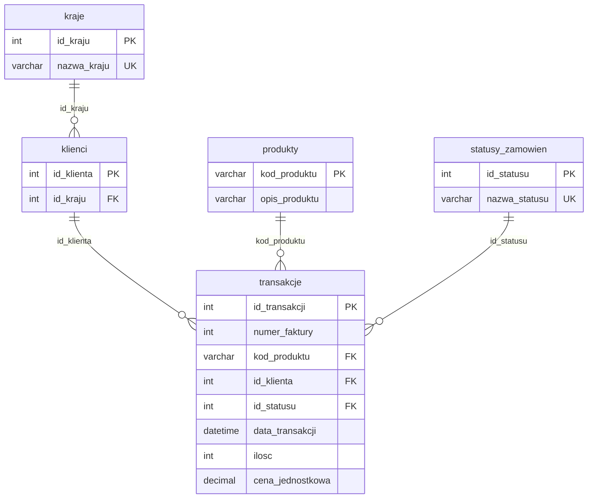

# Sklep-e-commerce-baza-danych-SQL-i-dashboard-Power-BI


Projekt obejmuje zaprojektowanie relacyjnej bazy danych sklepu internetowego, 20 zapytań analitycznych w SQL oraz interaktywny dashboard w Power BI zasilany widokiem SQL.

## Zawartość projektu

- Relacyjna baza `sklep_ecommerce` (MySQL / MariaDB): 5 tabel, klucze obce, ograniczenia `CHECK`
- Widok analityczny `v_dane_analityczne`, który czyści dane i służy jako źródło dla Power BI
- 20 zapytań analitycznych (złączenia, agregacje, podzapytania skorelowane i nieskorelowane, `HAVING`, zliczanie warunkowe) plus jedno zapytanie dodatkowe
- Wielostronicowy dashboard Power BI z miarami DAX

**Stos technologiczny:** MySQL / MariaDB, SQL, Power BI (DAX)

## Model danych



`transakcje` to tabela faktów, pozostałe tabele są słownikami i wymiarami. Spójność danych zapewniają:

- klucze główne i obce,
- `NOT NULL` i `UNIQUE` w słownikach,
- reguły `CHECK`: `cena_jednostkowa >= 0` oraz `ilosc <> 0`.

`id_klienta` w tabeli `transakcje` może być puste (`NULL`). Dotyczy to m.in. wszystkich pozycji ze statusem „Anulowane / Zwrot".

## Widok `v_dane_analityczne`

Widok łączy tabelę faktów z czterema wymiarami przez `LEFT JOIN`, dzięki czemu żadna transakcja nie jest gubiona przy niekompletnych kluczach obcych. Przenosi czyszczenie danych na stronę serwera, więc Power BI dostaje gotowy zestaw:

| Kolumna | Logika |
|---|---|
| `wartosc_pozycji` | `ROUND(ilosc * cena_jednostkowa, 2)` |
| `nazwa_produktu` | `CASE`: dla opisów `?` i `Brak opisu` zwraca `Nieznany Produkt (kod)` |
| `id_klienta` | `IFNULL(..., 0)` |
| `kraj_klienta` | `IFNULL(..., 'Niezdefiniowany Kraj')` |
| `status_zamowienia` | `IFNULL(..., 'Nieznany Status')` |

Filtr `WHERE` odrzuca rekordy bez daty oraz z datą `0000-00-00`.

## Zapytania analityczne

Wszystkie zapytania są w [`sql/02_zapytania_analityczne.sql`](sql/02_zapytania_analityczne.sql).

| # | Zagadnienie | Technika |
|---|---|---|
| 1 | Przychód, liczba faktur i sztuk per kraj | `JOIN`, `GROUP BY` |
| 2 | Średnia wartość koszyka per kraj | agregacja z `COUNT(DISTINCT)` |
| 3 | Przychody kwartalne | `YEAR`, `QUARTER` |
| 4 | Ranking lat wg przychodu | agregacja, sortowanie |
| 5 | Udział procentowy krajów w przychodzie | podzapytanie nieskorelowane |
| 6 | Top 10 produktów wg przychodu | `ORDER BY ... LIMIT` |
| 7 | Top 10 produktów wg liczby transakcji | agregacja |
| 8 | Ceny powyżej średniej w kraju | podzapytanie skorelowane |
| 9 | Produkty nigdy niesprzedane | `LEFT JOIN ... IS NULL` |
| 10 | Największa rozpiętość cenowa | `MIN`, `MAX`, `HAVING` |
| 11 | Top 10 klientów (VIP) | agregacja |
| 12 | Klienci powyżej średnich wydatków | podzapytanie w `HAVING` |
| 13 | Zarejestrowani vs kupujący klienci per kraj | `LEFT JOIN` |
| 14 | Klienci generujący najwięcej zwrotów | `IFNULL`, `ABS` |
| 15 | Klienci jednorazowi | `HAVING` |
| 16 | Zrealizowane vs zwrócone zamówienia | agregacja po statusie |
| 17 | Średnia liczba sztuk w pozycji wg lat | `AVG` |
| 18 | Transakcje hurtowe (> 500 sztuk) | filtrowanie |
| 19 | Miesiąc o najwyższym przychodzie | `GROUP BY` rok i miesiąc |
| 20 | Odsetek zwrotów per kraj | zliczanie warunkowe (`CASE`) |
| + | Ranking krajów w roku 2020 | filtr po roku |

## Wybrane wyniki

Poniższe liczby dotyczą transakcji zrealizowanych (`id_statusu = 1`). Dane nie zawierają informacji o walucie.

- **Struktura rynku:** Wielka Brytania generuje 718 907,84 przychodu, czyli 61,57% całości, przy 1741 fakturach. Kolejne rynki (Irlandia, Niemcy, Francja, Holandia) mają po 1,6-2,2%.
- **Wartość koszyka:** najwyższa średnia jest w Holandii (4793,39), przy zaledwie 4 fakturach. Wielka Brytania ma średnio 412,93.
- **Produkty:** największy przychód daje `22423` REGENCY CAKESTAND 3 TIER (36 035,98).
- **Zamówienia:** 2193 zamówienia zrealizowane i 101 anulowanych lub zwróconych (łącznie 10 418 zwróconych sztuk).
- **Rekordowy miesiąc:** lipiec 2020, przychód 99 618,20.
- **Ranking lat:** przychód roczny wyniósł 515 364,64 w 2020 oraz 251 576,63 w 2021. Dane z 2021 roku obejmują jednak niepełne, nieciągłe okresy (brak Q1 2021 w zestawieniu kwartalnym), więc nie należy ich traktować jako pełnego porównania rok do roku.

## Dashboard Power BI

Plik: [`powerbi/Dashboard.pbix`](powerbi/Dashboard.pbix). Źródłem danych jest widok `v_dane_analityczne`.

Wykorzystane elementy: miary DAX, własna tabela kalendarza, `CALCULATE` / `ALL` do kontroli kontekstu filtrów, `RANKX` dla wizualizacji Top N.

## Jak uruchomić

Wymagania: MySQL 8.0.16+ lub MariaDB 10.2.1+ (reguły `CHECK` są wymuszane od tych wersji), opcjonalnie Power BI Desktop do otwarcia dashboardu.

```bash
# 1. Utwórz bazę i załaduj strukturę oraz dane
mysql -u root -p -e "CREATE DATABASE IF NOT EXISTS sklep_ecommerce CHARACTER SET utf8mb4;"
mysql -u root -p sklep_ecommerce < sql/01_baza_i_dane.sql

# 2. Uruchom zapytania analityczne
mysql -u root -p sklep_ecommerce < sql/02_zapytania_analityczne.sql
```

Następnie otwórz `powerbi/Dashboard.pbix` w Power BI Desktop i w ustawieniach źródła danych wskaż własny serwer bazy.


## Znane ograniczenia jakości danych

- Część rekordów ma datę `0000-00-00`. Widok je odrzuca, więc analizy czasowe (kwartały, lata, najlepszy miesiąc) ich nie obejmują.
- Wszystkie zwroty i anulowania mają `id_klienta = NULL`. Zapytania łączące klientów przez `JOIN` (np. zapytanie 20) nie widzą więc zwrotów i pokazują 0%.
- Zapytanie 12 zawiera grupę `NULL`: sprzedaż bez przypisanego klienta wlicza się do średniej wydatków.
- Niektóre opisy produktów mają wartości `?` lub `Brak opisu`, a w katalogu są też pozycje techniczne (`POST`, `DOT`, `M`, `AMAZONFEE`), które nie są towarami.

## Źródło danych

Dane są fikcyjnym zbiorem sprzedażowym sklepu internetowego działającego na rynku międzynarodowym z repozytorium Kaggle.


Katowice, czerwiec 2026
